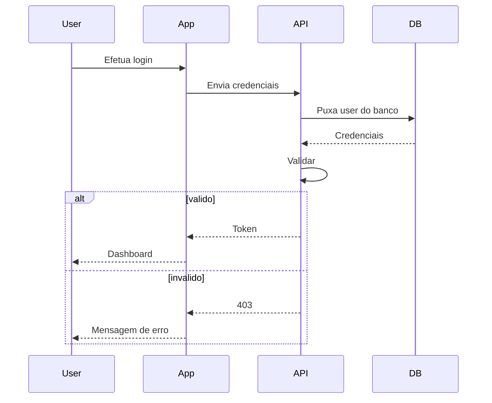
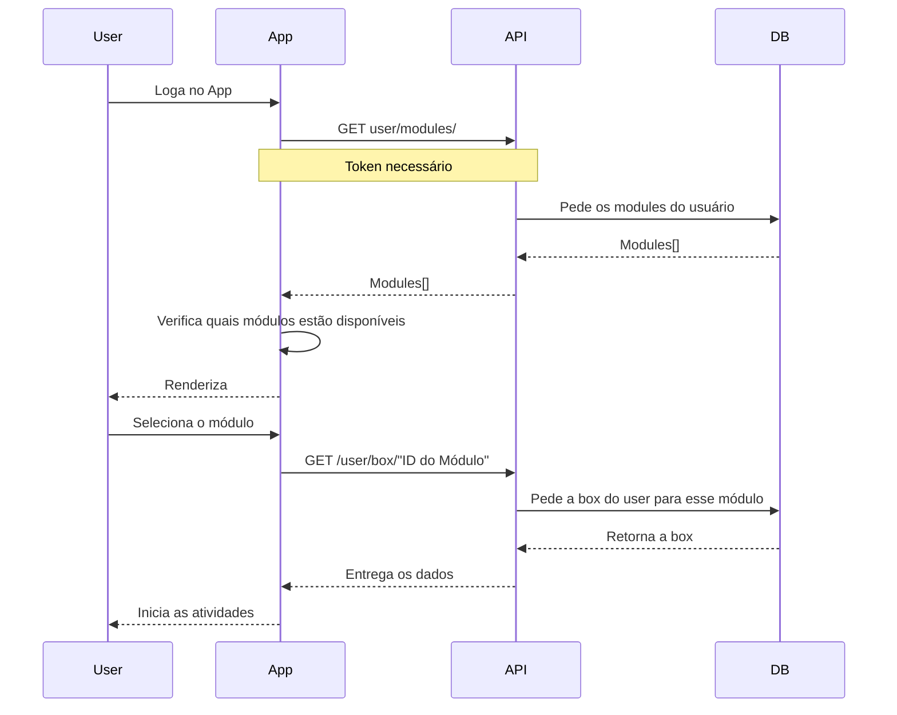
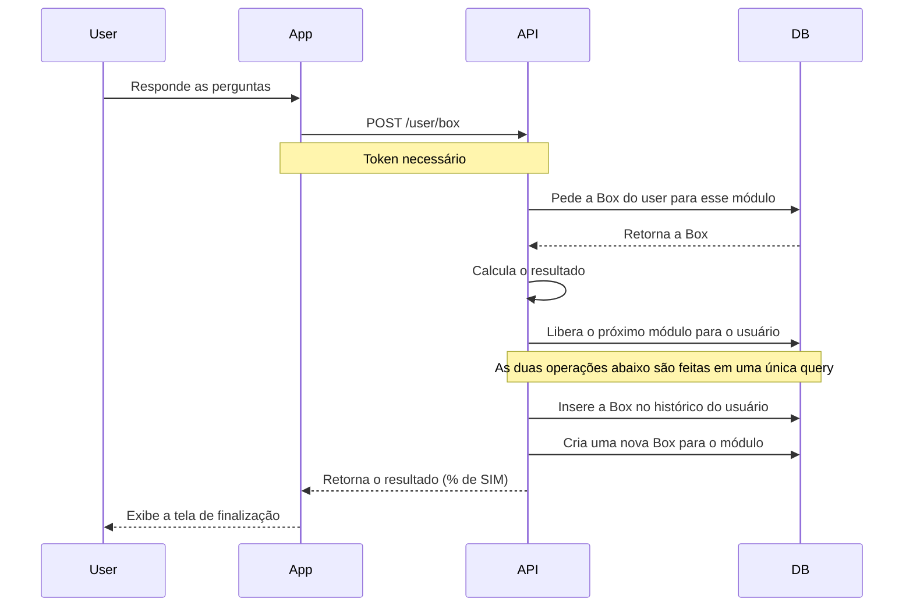

# Diagramas de Sequência

## Login


### Payload:

```typescript
interface Auth {
    email: string,
    password: string
}
```
---
## Jogo


### Resposta:
```typescript
// Retorna em GET user/modules/
interface Module {
    id: string,
    name: string,
    image: string,
    imageAlt: string,
    available: boolean // Isso diz se o usuário pode acessar o módulo.
}

// Retorna em /user/box/id_do_módulo
interface Box {
    module: string,
    activities: Array<{
        activity: Activity, 
        answers: boolean[]
    }>
}
```
---
## Responder atividade

### Payload:
```ts
interface Answer {
    module: string,
    answers: boolean[]
}
```