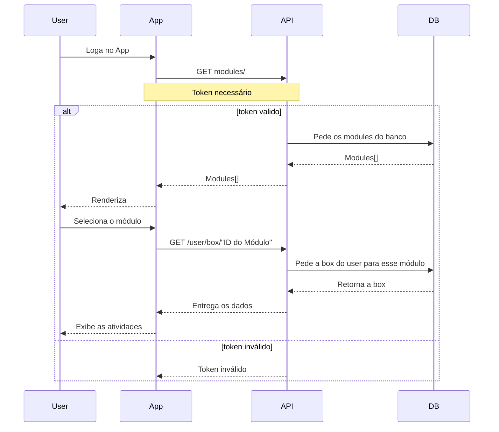

```mermaid
sequenceDiagram
    User->>App: Loga no App
    App->>API: GET modules/
    Note over App,API: Token necessário
    alt token valido
        API->>DB: Pede os modules do banco
        DB-->>API: Modules[]
        API-->>App: Modules[]
        App-->>User: Renderiza
        User->>App: Seleciona o módulo
        App->>API: GET /user/box/"ID do Módulo"
        API->>DB: Pede a box do user para esse módulo
        DB-->>API: Retorna a box
        API-->>App: Entrega os dados
        App-->>User: Exibe as atividades
    else token inválido
        API-->>App: Token inválido
    end
```